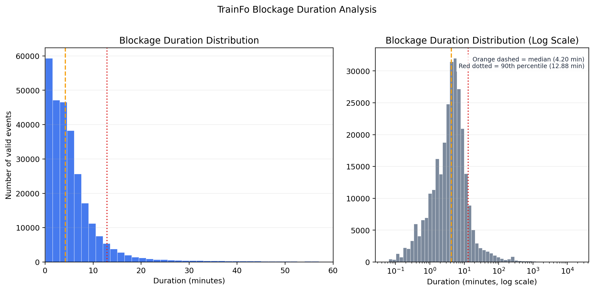
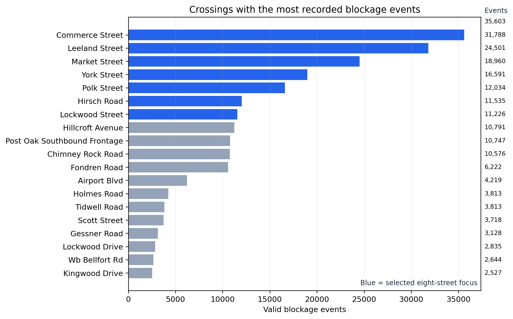
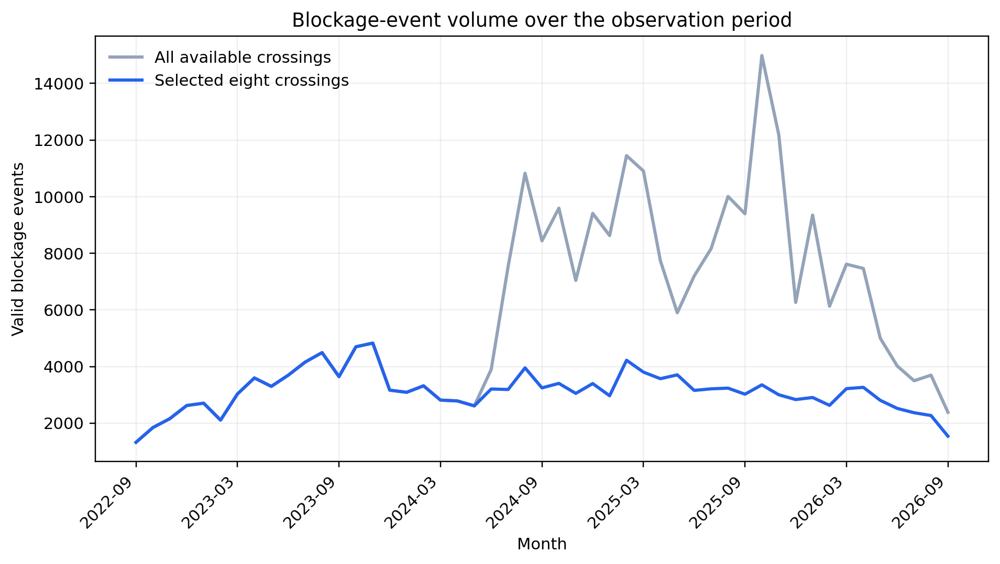
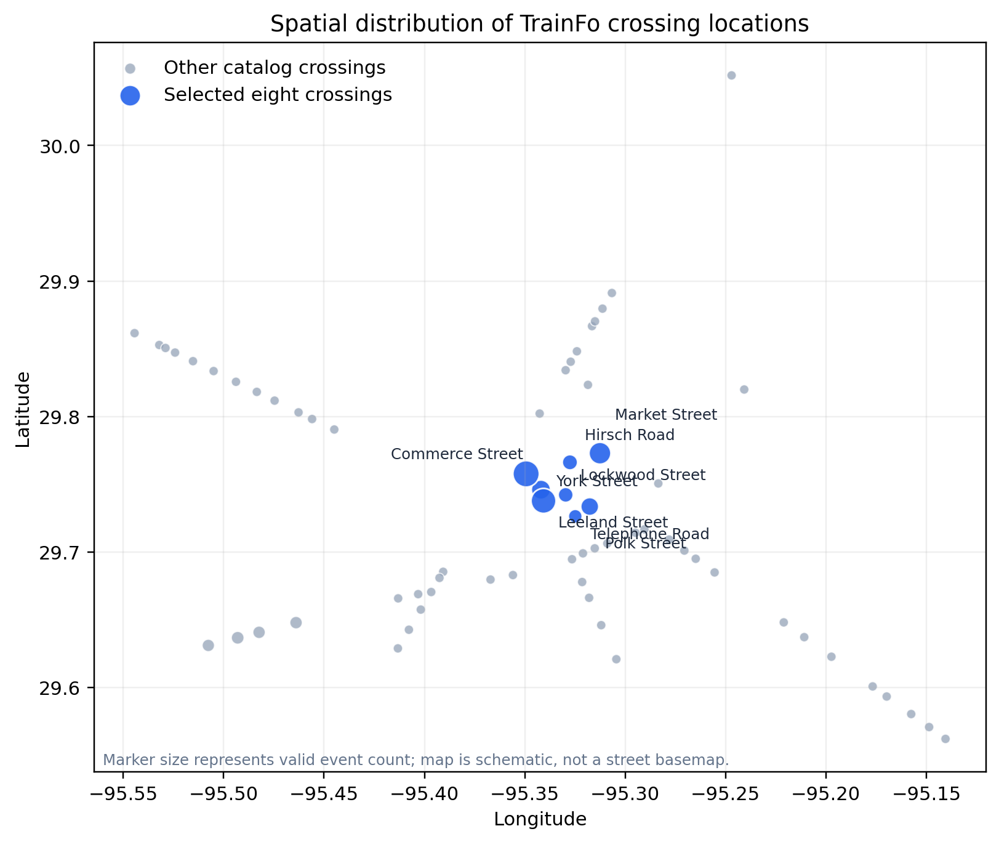

# 4 Data Science Pipeline

This section describes the data-science pipeline for the Houston rail-crossing blockage project. The pipeline is designed around the proposed objective: use prior crossing states, temporal information, and crossing metadata to predict whether a crossing will be blocked 5, 10, 15, or 30 minutes in the future.

The current work has finalized the raw event integration and event-level cleaning. The minute-level prediction table is the next pipeline stage and is described as a planned transformation below. This distinction is important because an event table records blockages, while a prediction table must also represent clear states and explicitly handle periods when the sensor is unavailable.

## 4.1 Data Wrangling

### 4.1.1 Raw Data Integration

The primary source is the TrainFo crossing-event data. Each raw CSV contains the reported crossing location, blockage date, blockage start time, and blockage duration. The crossing catalog supplies the TrainFo URL, display name, and FRA crossing identifier. The crossing-information file supplies the FRA identifier, latitude, longitude, map link, and source CSV URL. Latitude and longitude were therefore joined from the available crossing-information file; this report does not claim that coordinates were independently retrieved from a separate FRA download.

The raw event files are merged with crossing metadata using the FRA crossing number. The FRA number is preferred to street name because street names are not guaranteed to be unique: for example, the raw scrape contains two Telephone Road files and two Tidwell Road files with different FRA IDs. The merge therefore preserves those as separate crossings rather than combining them by street name. Street names and coordinates are retained as descriptive metadata and for GIS visualization.

The current fresh snapshot was collected on September 20, 2026. The catalog lists 68 crossing IDs. Raw files were available for 67 IDs; the Alameda/Genoa Road source was unavailable at the time of the scrape. The focused analysis contains the original eight available crossings: Commerce Street, Hirsch Road, Leeland Street, Lockwood Street, Market Street, Polk Street, Telephone Road, and York Street. Hughes Street is not present in the catalog and is not included.

| Source | Merge key | Information used |
|---|---|---|
| TrainFo raw CSVs | FRA ID from catalog/file name | Location, blockage date, start time, duration |
| Crossing catalog | FRA ID | Crossing name and TrainFo source URL |
| Crossing metadata | FRA ID | Latitude, longitude, map URL |
| Calendar/time derivation | Event timestamp | Date, time, weekday, hour, and later temporal features |

The reproducible merge command is:

```zsh
.venv/bin/python merge_raw_snapshot.py
```

It writes `data/processed/trainfo_all_merged_2026-09-20.csv` and `data/processed/trainfo_8streets_merged_2026-09-20.csv`.

### 4.1.2 Standardization and Removal of Irrelevant Variables

The raw TrainFo files use `duration` while the merged table uses the clearer name `duration (min)`. Dates are standardized to `M/D/YYYY`, and the source start time is retained, including seconds when TrainFo provides them. Coordinates are stored as numeric metadata in the merged table. The empty export column present in the earlier merged CSV was removed because it contains no information.

The raw `location` field is retained in the simple event export for traceability. In the metadata-enriched modeling table, `Crossing Name` and `FRA Number` provide the stable crossing identity. `Google Maps` and `Trainfo CSV` are reference fields rather than predictors. They are retained in the merged archive for auditability but should not be passed directly to a model.

Variables that reveal future information are excluded from predictors. In particular, the final blockage duration and calculated clearing time cannot be used to predict a future state at the blockage start because they are not known operationally at that time. A calculated end timestamp may be retained for event validation and retrospective summaries, but it is not a prediction feature.

### 4.1.3 Missing Values and Sensor Gaps

The current merged event table has no missing values in its required event or metadata fields after the available crossing metadata are joined. The one missing catalog source, Alameda/Genoa Road, is recorded as a source-coverage limitation rather than silently treated as an all-clear crossing. Missing event observations are different from missing cells: a time interval with no event record does not prove that a crossing was clear.

For the current raw snapshot, the unavailable Alameda/Genoa source is recorded as a coverage gap rather than silently treated as an all-clear crossing. For the eight-street subset, all eight requested source files are available. The pipeline preserves raw downloads and records the missing source in the scrape documentation. Because the event files do not contain sensor heartbeat or outage-status fields, the duration or location of smaller sensor gaps cannot yet be measured directly.

If the future minute-level table is implemented, the proposed policy is:

- Do not impute long sensor outages as clear states.
- Create `sensor_available` and `sensor_gap` indicators.
- Permit short gaps to be filled only when surrounding observations unambiguously show that the state did not change.
- Exclude training windows that require unavailable future labels or unavailable predictor history.
- Report missingness by crossing, date, month, and longest consecutive gap before modeling.

This policy would prevent the model from learning that “no sensor record” means “not blocked.” At the current event-level stage, no sensor-gap imputation has been performed.

### 4.1.4 Outlier and Invalid-Event Detection

Invalid events are identified using event-specific rules rather than a generic outlier cutoff. The current fresh scrape contains 285,263 raw event rows. It includes 487 records with invalid or nonpositive durations and 120 exact duplicate event keys. After removing those records, the event-level analytical table contains 284,656 rows.

The following completed checks are applied:

- Missing, nonnumeric, or nonpositive duration: exclude from the clean event table and count in the audit.
- Exact duplicate key consisting of FRA ID, location/crossing, date, start time, and duration: retain one copy.
- Duplicate source files: preserve them as raw provenance and retain separate FRA IDs in the merged table. The two Telephone Road files and two Tidwell Road files in the current scrape are exact duplicates byte-for-byte, but they represent separate FRA IDs and are retained as separate crossing records in the all-crossing table.

The current duration range is approximately -0.17 to 21,901.93 minutes before invalid records are removed. The maximum is therefore retained as a quality-review flag, not automatically deleted by an arbitrary one-hour rule.

The following outlier checks are planned but have not yet been completed: comparing each event with the crossing-specific duration distribution, reviewing extreme events against nearby records from the same sensor, and flagging rapid repeated transitions or overlapping events after the minute-level state reconstruction. These checks will help distinguish sensor errors from unusual but legitimate prolonged train blockages before any additional records are excluded.

Figure 4.1 shows that most blockage events are brief while also displaying the full right tail. The median valid duration is 4.20 minutes and the 90th percentile is 12.88 minutes. The left panel focuses on the 0–60 minute range for readability, while the right panel uses a logarithmic horizontal axis to display the full duration range. Extremely long events remain in the data and are discussed as a separate quality-review issue; they are not removed solely because they fall outside the left-panel display range.



### 4.1.5 Time-Series Restructuring

The raw data are asynchronous blockage events. Machine-learning models require synchronized observations. The exploratory review found 153,004 cleaned event records across the eight selected crossings, with event activity spanning approximately 1,475 calendar days and a median valid blockage duration of approximately 5.53 minutes. These results support using a one-minute crossing-time grid as the initial modeling resolution, because it preserves short events while keeping the representation interpretable for 5-, 10-, 15-, and 30-minute forecasts.

The one-minute grid should initially be treated as a candidate modeling table rather than a definitive sensor-state table. The current TrainFo files report blockage events but do not provide a separate sensor heartbeat or availability log. Therefore, a minute without a recorded blockage can be labeled clear only under an explicit assumption that the sensor was operating during that interval. The pipeline should include a `sensor_available` field and a sensitivity analysis comparing the results under alternative gap policies.

The proposed modeling representation is:

```text
Time       Commerce  Hirsch  Leeland  Lockwood  ...
08:00      0         0       0        0
08:01      0         1       0        0
08:02      1         1       0        0
```

For each crossing and minute, `state = 1` when the minute falls within a valid blockage interval and `state = 0` only when the sensor is considered available and no blockage is active. Minutes affected by an unresolved sensor gap are marked unavailable rather than automatically assigned zero. The first implementation should report how many rows are retained under the event-interval assumption and how many are excluded under conservative gap rules.

This transformation requires a precise interval convention. The recommended convention is a half-open interval `[start, end)`: the blockage is active at the start minute and ends at, but does not include, the calculated end timestamp. Overlapping events should be flagged before collapsing them to one binary state.

### 4.1.6 Feature Engineering

Features will be created only from information available at prediction time. They fall into four groups.

**Temporal features**

- `hour`
- `minute`
- `day_of_week`
- `is_weekend`
- `month`
- holiday indicator when a validated calendar source is available
- `hour_sin`, `hour_cos` for cyclical hour encoding
- weekday cyclical encodings if needed

**Current-state features**

- `current_state`
- `minutes_in_current_state`
- `sensor_available`
- `sensor_gap`

**Historical blockage features**

- `minutes_since_last_blockage`
- `blockages_last_30m`
- `blockages_last_60m`
- `blocked_fraction_last_30m`
- `blocked_fraction_last_60m`
- `blocked_fraction_last_6h`
- recent mean and median blockage duration

**Spatial and crossing features**

- latitude and longitude
- FRA crossing ID as a categorical identifier
- upstream or neighboring crossing state at time `t`
- `neighbor_blocked_count`
- corridor blockage rate after a corridor/neighbor definition is supplied

The current data directly support crossing identity, coordinates, dates, times, and durations. Corridor membership and neighbor relationships should be added only after they are defined and documented; they should not be inferred casually from map proximity.

### 4.1.7 Prediction Targets

For each crossing-time row at time `t`, the future targets are:

```text
target_5m  = state at t + 5 minutes
target_10m = state at t + 10 minutes
target_15m = state at t + 15 minutes
target_30m = state at t + 30 minutes
```

The target is binary: `1` means blocked and `0` means clear. A target is missing when the future sensor state is unavailable or when the required future timestamp is outside the observed period. The target construction must occur after state reconstruction and must never use future blockage duration, clearing time, or future crossing states as predictors.

### 4.1.8 Class Imbalance

Class imbalance cannot be finalized from the event-only table because event rows represent blockages and do not include the clear-state minutes. After the one-minute state grid is constructed, the proportion of blocked and clear states should be reported overall and by crossing for each forecast horizon.

The modeling workflow should use imbalance-aware evaluation. Accuracy alone is not sufficient. Recommended metrics include precision, recall, F1 score, balanced accuracy, area under the precision-recall curve, and calibration. Resampling or class weighting should be applied only within the training data and never before a time-based train/test split.

### 4.1.9 Final Data Volume

The current event-level volume after the fresh scrape is:

| Processing stage | All available crossings | Eight-street subset |
|---|---:|---:|
| Catalog crossing IDs | 68 | 8 selected IDs |
| Raw source files available | 67 | 8 |
| Raw event rows | 285,263 | 153,141 |
| Invalid/nonpositive-duration rows | 487 | 18 |
| Exact duplicate event keys | 120 | 119 |
| Event rows after cleaning | 284,656 | 153,004 |
| Final one-minute modeling rows | Not yet constructed | Not yet constructed |

The final modeling row count depends on the retained date range, one-minute grid, sensor-gap exclusions, and the number of target horizons. It must be reported after those decisions are implemented rather than estimated from event counts. The current table therefore satisfies the event-level data-volume requirement, while the minute-level modeling volume remains pending.

## 4.2 Exploratory Visualizations

The initial exploratory figures summarize the event-level data before the minute-level prediction table is constructed. They are descriptive rather than model-performance results.

Figure 4.2 ranks crossings by the number of valid blockage events. The values are placed outside the bars for readability. The selected eight crossings are highlighted in blue, showing why crossing-level comparisons are needed instead of treating all crossings as equally active.



Figure 4.3 displays monthly event volume for all available crossings and the selected eight crossings. It documents temporal coverage and helps identify periods that may need additional investigation before a time-based train/test split is chosen.



Figure 4.4 is provided as an interactive GIS map rather than only a static coordinate plot. The map uses the available crossing coordinates, highlights the selected eight crossings, supports an all-available-crossings view, and allows the reader to inspect event counts and recent blockage summaries by crossing. It is available at [`visualizations/crossing_activity_map.html`](../visualizations/crossing_activity_map.html). The map shows spatial concentration and motivates later investigation of neighboring or corridor-level relationships; it is not evidence by itself of a causal or operational relationship between crossings.



## Variable Dictionary

### Current event-level table

| Variable | Type | Definition | Modeling role |
|---|---|---|---|
| `FRA Number` | categorical | Stable FRA crossing identifier. | Crossing key and categorical feature. |
| `location` | categorical | Location value from the raw TrainFo event file. | Traceability; standardized name preferred. |
| `Crossing Name` | categorical | Catalog crossing/street name. | Display and categorical feature. |
| `Latitude` | numeric | Crossing latitude from metadata. | Spatial feature/GIS. |
| `Longitude` | numeric | Crossing longitude from metadata. | Spatial feature/GIS. |
| `blockageDate` | date | Date on which the event began. | Timestamp component. |
| `blockageStartTime` | time | Time at which the event began. | Timestamp component. |
| `duration (min)` | numeric | Reported blockage duration in minutes. | Event validation and retrospective analysis; not a future predictor when it describes the current/future event. |
| `Google Maps` | reference URL | Coordinate-based map link. | Traceability only. |
| `Trainfo CSV` | reference URL | Original TrainFo source URL. | Provenance only. |

### Derived event-level variables

| Variable | Type | Definition |
|---|---|---|
| `blockageEndDate` | date | Date calculated from start timestamp plus duration. |
| `blockageEndTime` | time | Time calculated from start timestamp plus duration. |
| `event_valid` | binary | Whether duration and timestamp pass validation. |
| `duplicate_event` | binary | Whether the event key occurred previously in the same crossing file. |

### Planned minute-level modeling variables

| Variable | Type | Definition |
|---|---|---|
| `timestamp` | datetime | One-minute prediction timestamp. |
| `state` | binary | `1` blocked, `0` clear when sensor is available. |
| `sensor_available` | binary | Whether the crossing has usable sensor coverage at the timestamp. |
| `sensor_gap` | binary | Whether the timestamp lies in an unresolved sensor gap. |
| `minutes_in_current_state` | numeric | Minutes since the current blocked/clear state began. |
| `blocked_fraction_last_30m` | numeric | Fraction of available minutes blocked in the prior 30 minutes. |
| `blocked_fraction_last_60m` | numeric | Fraction of available minutes blocked in the prior 60 minutes. |
| `blockages_last_30m` | integer | Number of blockage starts in the prior 30 minutes. |
| `neighbor_blocked_count` | integer | Number of defined neighboring crossings blocked at time `t`. |
| `hour_sin`, `hour_cos` | numeric | Cyclical encodings of time of day. |
| `target_5m` | binary | Crossing state at `t + 5` minutes. |
| `target_10m` | binary | Crossing state at `t + 10` minutes. |
| `target_15m` | binary | Crossing state at `t + 15` minutes. |
| `target_30m` | binary | Crossing state at `t + 30` minutes. |

## Current status

Completed: raw download preservation, FRA-keyed metadata merge, all-crossing and eight-street event exports, duplicate/invalid-event audit, and event-level report files.

Next: implement and validate the one-minute state grid, quantify sensor gaps, construct leakage-safe features and targets, and report the final modeling-table volume and class balance.
