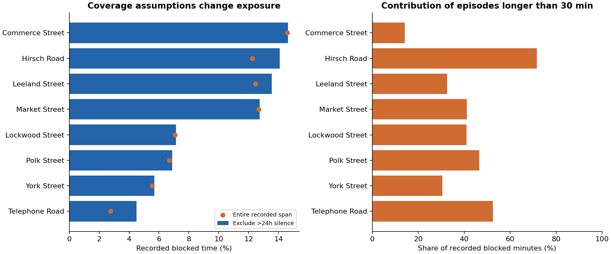
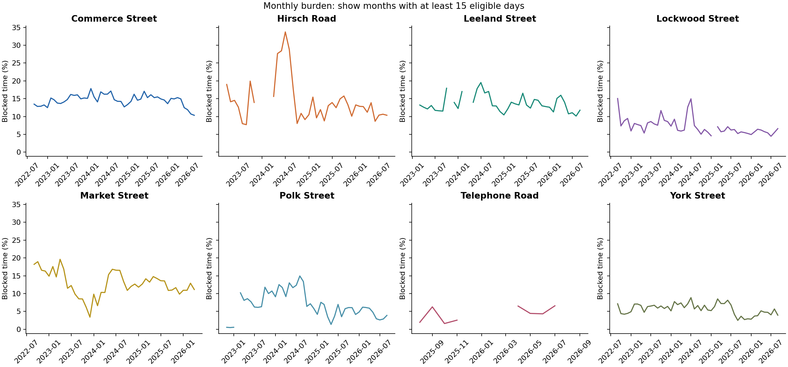
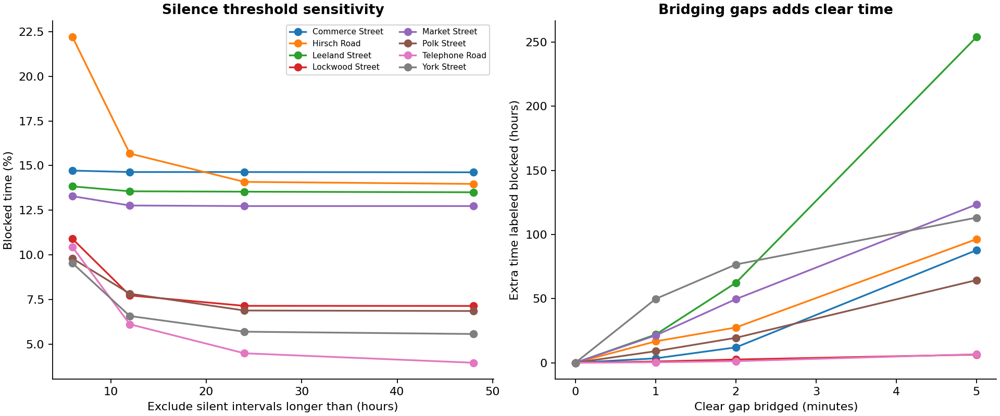
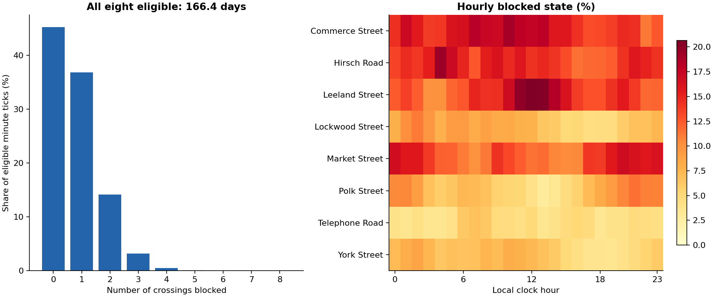
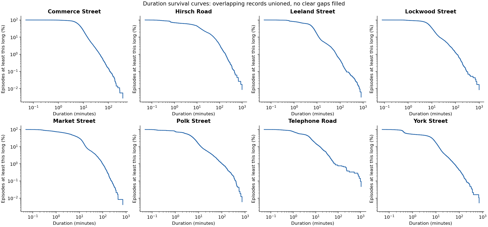
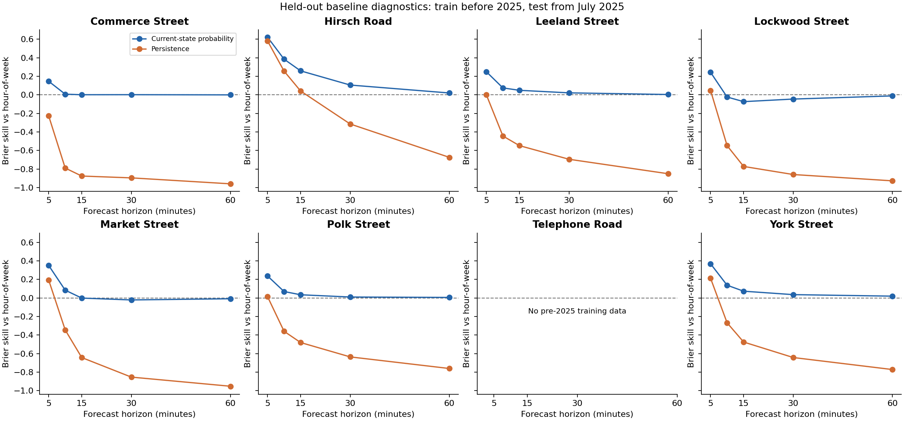

# HFD crossing EDA: consolidated findings

Generated from the local September 20, 2026 export.

## What the extended analysis shows

The focused export contains 153,141 rows. Removing invalid/nonpositive durations and duplicate event keys leaves 153,004 records, representing 150,162 disjoint blockage episodes after overlap union. Commerce Street has the largest recorded blocked-time share under the 24-hour silence scenario (14.64%). At Hirsch Road, episodes longer than 30 minutes account for 71.6% of blocked time. Bridging gaps up to two minutes adds 251.2 hours of originally clear time across the eight crossings.

## Crossing burden and long tails

The denominator is each crossing's first valid start through last valid end, minus entire silent gaps longer than 24 hours. This is an assumed eligible window, not verified uptime. Long durations are retained and should be investigated with the provider. Unioning overlaps avoids counting the same blocked minute twice. No short clear gaps are filled in the primary analysis.

| Name | Union episodes | Median min | P90 min | Blocked pct span | Blocked pct eligible | Over 30 time share pct |
| --- | --- | --- | --- | --- | --- | --- |
| Commerce Street | 35522 | 6.88 | 14.50 | 14.60 | 14.64 | 14.08 |
| Hirsch Road | 11240 | 7.75 | 55.48 | 12.26 | 14.09 | 71.63 |
| Leeland Street | 31067 | 5.18 | 11.94 | 12.46 | 13.54 | 32.51 |
| Lockwood Street | 11508 | 7.90 | 21.20 | 7.08 | 7.15 | 40.96 |
| Market Street | 23775 | 4.52 | 18.69 | 12.67 | 12.73 | 41.14 |
| Polk Street | 16213 | 3.80 | 12.77 | 6.69 | 6.89 | 46.57 |
| Telephone Road | 2094 | 3.28 | 15.24 | 2.76 | 4.49 | 52.56 |
| York Street | 18743 | 1.63 | 13.13 | 5.55 | 5.70 | 30.46 |

## Time trends and comparable seasons

Monthly lines omit months with fewer than 15 eligible days. Missing lines do not mean zero blockages. The table compares July–August 2025 with the same months of 2026 to reduce seasonal and partial-month confounding. Market has no July–August 2026 records, so that comparison is unavailable. Differences still mix train activity, duration quality, and sensor availability. Bootstrap intervals in the supporting table resample whole days with at least 12 eligible hours, use 1,000 draws, and do not account for dependence across days or systematic coverage errors.

| Name | Year | Eligible days | Blocked pct |
| --- | --- | --- | --- |
| Commerce Street | 2025 | 62.00 | 15.70 |
| Commerce Street | 2026 | 62.00 | 11.31 |
| Hirsch Road | 2025 | 62.00 | 13.19 |
| Hirsch Road | 2026 | 59.42 | 10.51 |
| Leeland Street | 2025 | 62.00 | 12.79 |
| Leeland Street | 2026 | 62.00 | 10.59 |
| Lockwood Street | 2025 | 62.00 | 6.27 |
| Lockwood Street | 2026 | 62.00 | 4.97 |
| Market Street | 2025 | 62.00 | 13.57 |
| Market Street | 2026 | — | — |
| Polk Street | 2025 | 62.00 | 5.22 |
| Polk Street | 2026 | 62.00 | 2.73 |
| Telephone Road | 2025 | 33.78 | 1.79 |
| Telephone Road | 2026 | 31.30 | 7.45 |
| York Street | 2025 | 54.94 | 5.48 |
| York Street | 2026 | 58.78 | 4.88 |

## Sensitivity to preparation choices

The primary analysis retains suspect burst days rather than treating an unverified flag as proof of a fault. The archive's centered 29-active-day rolling rule is retrospective and must not be used as an online feature. Silence thresholds of 6, 12, 24, 48 hours and no silence exclusion are reported separately. Merge thresholds of 0, 1, 2 and 5 minutes use the same zero-gap exposure denominator so the additional blocked time is explicit. The table also quantifies exclusion of suspect days identified by the contributed centered burst heuristic, rebuilt from valid two-minute-merged episodes. It subtracts those days from both continuous blocked time and eligible exposure, without labeling the flags as confirmed faults.

| Name | Suspect days | Retained blocked pct | Excluded blocked pct | Excluded eligible days |
| --- | --- | --- | --- | --- |
| Commerce Street | 0 | 14.64 | 14.64 | 0.00 |
| Hirsch Road | 4 | 14.09 | 14.02 | 3.92 |
| Leeland Street | 0 | 13.54 | 13.54 | 0.00 |
| Lockwood Street | 0 | 7.15 | 7.15 | 0.00 |
| Market Street | 0 | 12.73 | 12.73 | 0.00 |
| Polk Street | 0 | 6.89 | 6.89 | 0.00 |
| Telephone Road | 0 | 4.49 | 4.49 | 0.00 |
| York Street | 3 | 5.70 | 5.70 | 3.00 |

## Simultaneous blockage and daily timing

All eight crossings share 166.4 eligible days under the silence assumption. The strongest pairwise simultaneous-blockage lift is Lockwood Street / York Street (5.68 times the product of their marginal rates on jointly eligible minutes). Pairwise windows differ. Association does not establish a shared train, travel direction, or a route obstruction. Hourly estimates use exact minute ticks and can differ slightly from continuous-time burden. Concurrency includes every possible count from zero through eight.

| A | B | Joint eligible days | A blocked pct | B blocked pct | Both blocked pct | P b given a pct | Lift |
| --- | --- | --- | --- | --- | --- | --- | --- |
| Lockwood Street | York Street | 1419.65 | 7.50 | 6.19 | 2.64 | 35.20 | 5.68 |
| Polk Street | Telephone Road | 304.76 | 4.77 | 4.49 | 0.81 | 16.90 | 3.77 |
| Commerce Street | York Street | 1428.47 | 15.51 | 6.19 | 2.06 | 13.27 | 2.14 |
| Telephone Road | York Street | 286.90 | 4.53 | 4.59 | 0.27 | 5.86 | 1.28 |
| Hirsch Road | Polk Street | 1095.00 | 14.47 | 7.13 | 1.28 | 8.85 | 1.24 |
| Commerce Street | Leeland Street | 1204.50 | 15.69 | 14.38 | 2.69 | 17.15 | 1.19 |
| Hirsch Road | Telephone Road | 302.78 | 12.94 | 4.50 | 0.63 | 4.87 | 1.08 |
| Leeland Street | Telephone Road | 305.26 | 14.03 | 4.49 | 0.67 | 4.78 | 1.07 |

## Duration tails and remaining waits

Survival curves and remaining-duration tables describe completed, recorded union episodes. The remaining wait is conditional on an episode exceeding the stated elapsed time, with the number at risk reported. Boundary censoring and source truncation are unknown. These estimates describe recorded blockages and are not estimates of fire-engine response delay.

## Forecast readiness

A lightweight baseline check predicts blocked state at 5, 10, 15, 30 and 60 minutes. Models use training targets before January 2025, validation from January–June 2025, and test from July 2025 onward. Every tick between issue and target must be eligible, and issue/target timestamps must stay within the evaluation split. Baselines are hour-of-week frequency, persistence, and an empirical probability conditional on the current state, with 20 training observations of shrinkage. Telephone has no pre-2025 training history and is omitted from these fitted baselines. Brier scores and counts are supplied per crossing, horizon, model and split. These are retrospective diagnostics: silence masks use future information and sensor uptime must be available independently for an operational evaluation. Earlier archived model scores require correction before reuse. The table shows 10-minute test skill by crossing; positive values improve on the hour-of-week baseline, and negative values are worse.

| Name | Current state probability | Persistence |
| --- | --- | --- |
| Commerce Street | 0.01 | -0.79 |
| Hirsch Road | 0.38 | 0.26 |
| Leeland Street | 0.07 | -0.44 |
| Lockwood Street | -0.02 | -0.55 |
| Market Street | 0.08 | -0.35 |
| Polk Street | 0.07 | -0.36 |
| York Street | 0.14 | -0.27 |

## Source audit and reproducibility

The full source has 285,263 rows and 67 FRA identifiers. Identical complete timestamp/duration multisets occur in these identifier groups: [['176296N', '758750G'], ['288051H', '755355M']]. Focused/full-source multiset match: True. Do not count identical feeds as independent evidence. Input SHA-256 hashes and package versions are stored in manifest.json. Timestamps remain naive local-clock values because the source does not supply offsets. DST ambiguity remains unresolved; absence of events in a clock hour does not prove a timezone. Run `.venv/bin/python -m analysis.run_eda` from the repository root.

| Fra | Name | Raw rows | Invalid rows | Duplicate keys |
| --- | --- | --- | --- | --- |
| 288039B | Polk Street | 16594 | 3 | 28 |
| 288051H | Telephone Road | 2113 | 2 | 0 |
| 288129A | Commerce Street | 35603 | 0 | 0 |
| 288224V | Leeland Street | 31797 | 9 | 16 |
| 755640L | Hirsch Road | 12035 | 1 | 51 |
| 755709E | Market Street | 24504 | 3 | 16 |
| 859517C | York Street | 18960 | 0 | 8 |
| 859523F | Lockwood Street | 11535 | 0 | 0 |

## Next research priorities

Obtain sensor heartbeat/uptime and timezone documentation; adjudicate long records and suspect burst days; validate actual rail connectivity before interpreting lead–lag results; add dispatch timestamps and routes before translating crossing burden into HFD response impact. A subsequent model evaluation should use causal missingness handling, a frozen validation design, calibration, and held-out crossing/time tests.
